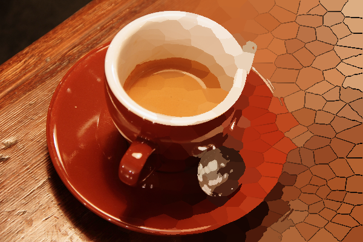

# Notes_image_processing

A collection of personal notebooks that illustrate various image processing techniques as well as some experimentation. The above image is the result of experimenting with building a superpixel segmentation algorithm (see notebook 06_Superpixel.ipynb).

im_func.py contains helper functions

**Libraries used:** skimage, sklearn, numpy, matplotlib